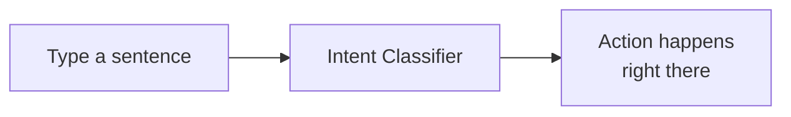
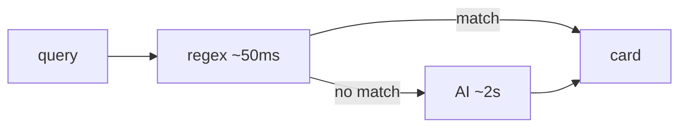
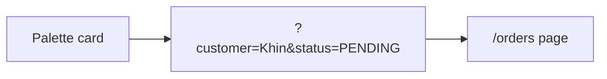
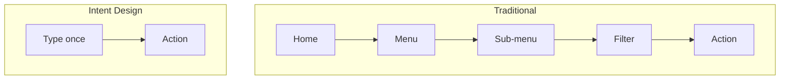

# Intent Design — Software That Listens to You

> **Stop making the user learn the software. Make the software learn the user.**

---

## 1. What is Intent Design?

You type what you want. The app does it.

No menus. No clicking through tabs. One text box.

- **Old way:** *"Where is the button to mark this order paid?"*
- **New way:** *"Mark order #1042 paid."* → done.

---

## 2. Why Intent Design?

Menus make new users do homework:
1. **Where** is the feature?
2. **What** is it called?
3. **Which** clicks open it?

Intent Design skips all three. The user speaks. The system meets them.

> *"We make the system understand the user — not the other way around."*

---

## 3. What You Need to Know

Four pieces.

**3.1 Classifier first, AI second** — regex matches common queries in 50ms. AI handles only the weird stuff.

**3.2 Build cards, not paragraphs** — every answer is a small interactive card. The user acts right there.

**3.3 Card and page share one URL** — same filters in both places. They never disagree.

**3.4 Chain the next step** — after each result, show 2–3 follow-up chips. One palette open, many actions.

---

## 4. Advantages Over Traditional Design

| Task | Traditional | Intent Design |
|---|---|---|
| Pending orders | Orders → Filter → Pending | Type *"pending orders"* |
| Mark paid | Order page → scroll → click | Type *"mark #1042 paid"* |
| Customer's orders | Customers → search → Orders tab | Type *"Khin Hnin orders"* |
| Ask in Myanmar | Hope menus are translated | Type in Myanmar |

**Five wins:**
1. No learning curve.
2. Any language works.
3. Action happens in place.
4. Fast for experts, easy for beginners.
5. Accessible by default (type = speak).

> *Traditional: "Learn me first."*
> *Intent: "Tell me, I'll do it."*

---

See it live: [case-study-po-ai-intent.html](case-study-po-ai-intent.html)
